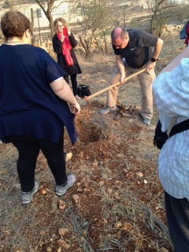
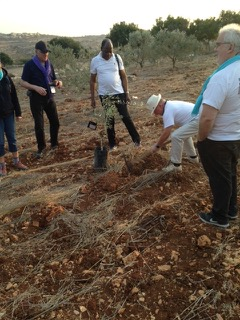
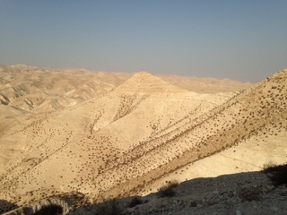
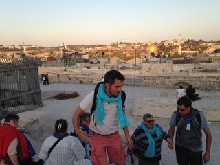

Du 7 au 15 novembre, 51 voyageurs/pèlerins dont deux-tiers de personnes situation de précarité ont marché, prié, chanté, célébré et vécu en Terre Sainte des moments exceptionnels de foi et de fraternité.
<!--more-->
## Texte de Chantal Joly

Des roselières peuplées d’oiseaux. Le miroir du lac reflétant le ciel et en face, au soleil couchant, les montagnes dans une ombre bleutée. 2000 ans plus tard, le paysage est quasiment identique à celui que Jésus a contemplé. Il règne en cette fin de journée à Tagbha au bord de la mer de Galilée (plus connue sous le nom de lac de Tibériade) une paix presque irréelle. Aucun signe de modernité, si ce n’est le klaxon lointain d’un car.

Dans une sorte de chapelle de plein vent abritée par un toit de paillage et de tôle, les trois prêtres qui ont accompagné le pèlerinage célèbrent autour d’un autel de pierre brute la dernière messe du séjour. Forcément, le texte d’Évangile choisi est celui dans lequel le Christ proclame à ses apôtres qu’il fera d’eux des « pêcheurs d’hommes » (Marc 4, 35-41). En son nom, François, Frédérique-Marie et Guy, imposent les mains pour envoyer en mission « chez eux et partout où le Christ les enverra » les membres de chaque fraternité tandis que l’assemblée chante « Ne rentrez pas chez vous comme avant. Ne vivez pas chez vous comme avant. Changez vos cœurs, cassez vos peurs. Vivez en hommes nouveaux ! ».

Car si le pèlerinage prend malheureusement fin ce jeudi 14 novembre, le chemin dans les pas de Jésus « venu annoncer la Bonne Nouvelle aux pauvres » ne s’arrête pas sur cette terre de Galilée. Tous sont invités à le poursuivre dès le lendemain sur la terre de Paris ainsi que sur celle de Bretagne, renouvelés dans la foi, l’espérance et la charité par ce voyage qui restera pour la plupart inoubliable.

### La Bible a pris vie

Que de moments intenses vécus en effet au cours de ces sept journées ! Il y eut d’abord la découverte d’un pays : celui de la Bible. Le Jourdain, le tombeau d’Hérode, le mont Nébo, la grotte de Bethléem, le tombeau vide de la Résurrection, le temple de Jérusalem, Gethsémani… nombre de lieux évoqués dans l’Ancien Testament, les Évangiles et d’autres textes de la Parole de Dieu, sont devenus visibles, réels, vivants. Et ce malgré les foules innombrables présentes sur les lieux saints, mondialisation du tourisme oblige.

Guide infiniment précieux, le Père Guy Tardivy, Dominicain, l’aumônier de la Maison d’Abraham (voir encadré), a promené le groupe dans les paysages et les siècles : « Jéricho est une des plus anciennes villes de la région. C’était un lieu d’hospitalité, une oasis » ; « Jésus passait là-bas en longeant le Jourdain du côté de la Jordanie actuelle mais à l’époque il n’y avait pas de barbelés, pas de frontière », « Nous traversons ici le village de Cana. Les Romains y avaient construit une ville pour se refaire une santé car il y avait des sources. Cette voie romaine était comme une autoroute à l’époque. Des commerçants de tous pays passaient par là ».

Grâce à lui, le passé devenait présent et une expression telle que Jésus est monté à Jérusalem prenait toute son ampleur, chacun mesurant en bus la distance accomplie à l’époque par Jésus, celui que le poète Christian Bobin nomme si merveilleusement L’homme qui marche.

### Vieilles pierres, pierres vivantes

Sur cette terre qu’Il a longuement arpentée, les gestes accomplis par le Christ, reproduits en 2019, retrouvent tout leur sens. C’est ainsi qu’une partie du groupe s’est immergé dans le Jourdain au lieu supposé de son baptême par Jean-Baptiste et que quelques-uns ont lavé les pieds de leurs compagnons de voyage avec les Sœurs de la communauté de l’Emmanuel à Bethléem. Certains ont touché avec émotion les pierres du saint Sépulcre et les uns et les autres ont pu longuement prier et lire l’Évangile le long du chemin de croix à Jérusalem, au champ des Bergers à Bethléem, à la basilique de l’Annonciation à Nazareth, dans le jardin des Oliviers ou encore à St Pierre en Gallicante, là où Pierre aurait renié trois fois Jésus.

Sur cette Histoire et cette géographie se greffe la réalité contemporaine. Et celle-ci est à la fois passionnante et douloureuse ! Passionnante du fait de la découverte d’un pays cher aux trois religions monothéistes, l’appel du muezzin retentissant, par exemple, au moment où le Père Guy situait pour le groupe de catholiques français de retour du mur des Lamentations le lieu où se tenaient les marchands du Temple. Douloureuse à cause des déchirures entre chrétiens mais surtout du conflit entre Palestiniens et Israéliens.

C’est en longeant le mur de séparation, escorté par Sœur Thérèse, une franciscaine, que le groupe a pu physiquement s’en rendre compte. Les dessins d’enfants palestiniens jouant à la corde avec des fils barbelés ou de fourmis observées par une fillette en train de ramasser des balles, ont beaucoup marqué les esprits. Tout comme la fresque de « Notre-Dame qui fait tomber les murs » devant laquelle le groupe a prié et fait le geste symbolique de pousser les murs de la haine, de la discrimination et de l’humiliation.

Encore plus touchante a été la journée passée à la Tente des Nations avec une famille palestinienne chrétienne résistant de façon non violente -son slogan est « Nous refusons d’être ennemis »– afin de conserver sa ferme encerclée par cinq colonies juives. Les oliviers plantés par le groupe y incarneront le fragile espoir de paix qui subsiste encore sur cette terre. Tout comme le dialogue avec Mona, une femme-courage, mariée à 16 ans et aujourd’hui étudiante en ressources humaines, coordinatrice d’une association rassemblant des femmes musulmanes et juives afin d’améliorer leur condition.

Autres belles rencontres : une soirée passée au clair de lune avec l’hospitalité chaleureuse des Bédouins, les « parias », du pays, ou encore, pour les héroïques du groupe, l’expédition dans le désert avec Youssef qui les a remis sur le droit chemin alors qu’ils s’étaient égarés.

C’est également entre eux que les 51 pèlerins ont vécu de beaux moments. Ils ont échangé en profondeur, partagé des pique-niques et des fous-rires (la dernière veillée fut particulièrement joyeuse avec un quizz, des mimes, des chants et un conte biblique), parcouru les souks ensemble, ils se sont écoutés avec respect, ont écrit des cartes à ceux qui n’ont pu venir, ont soutenu les plus fragiles lorsqu’il fallait pousser les fauteuils roulants dans des ruelles pleines d’escaliers peu adaptées au handicap, etc. Cette solidarité et cette vie fraternelle furent assurément deux merveilles du pèlerinage. Des ponts d’amitié et parfois de réconciliation furent ainsi construits ou solidifiés. Et ce pèlerinage jusqu’alors inédit aura œuvré au final aussi bien à la paix des cœurs qu’à celle des peuples.

**L’intégralité du texte et des témoignages sont** [ici](documents/REPORTAGE-TERRE-SAINTE-2.docx)